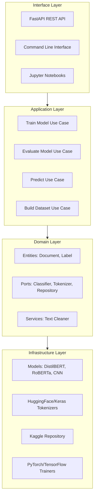
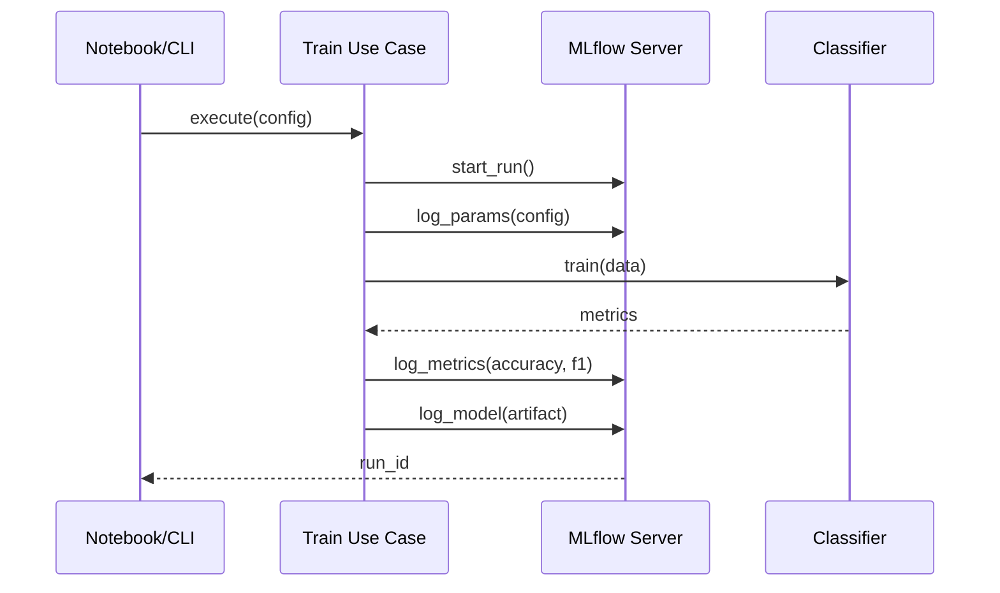

# Mental Health NLP Classification — Clean Architecture & MLOps

A production-ready NLP system for mental health sentiment analysis, implementing Clean Architecture, MLOps best practices, and multi-framework model support (PyTorch/TensorFlow).

[](https://www.python.org/)
[](https://pytorch.org/)
[](LICENSE)

---

## Table of Contents

- [Overview](#overview)
- [Dataset](#dataset)
- [Architecture](#architecture)
- [Models](#models)
- [API](#api)
- [MLOps Pipeline](#mlops-pipeline)
- [Installation](#installation)
- [Usage](#usage)
- [Project Structure](#project-structure)
- [Testing & CI/CD](#testing--cicd)
- [Acknowledgments](#acknowledgments)
- [Contact](#contact)

---

## Overview

This project addresses the critical need for automated mental health sentiment detection from textual data. The system classifies text into mental health categories (Normal, Anxiety, Depression, etc.) while maintaining enterprise-grade code quality and deployment readiness.

### Key Features

- **Clean Architecture** — Domain-driven design with strict separation of concerns
- **Framework Agnostic** — Interchangeable PyTorch/TensorFlow models via dependency inversion
- **Production Ready** — FastAPI REST API with Docker deployment
- **MLOps Integration** — Full experiment tracking with MLflow
- **Extensible Design** — Add new models without changing core business logic
- **Comprehensive Testing** — Unit, integration, and E2E tests with CI/CD

### Business Use Cases

- Mental health chatbot development
- Sentiment analysis dashboards
- Early detection systems for psychological distress
- Mobile health monitoring applications
- Academic research on mental health patterns

---

## Dataset

### Source
[Sentiment Analysis for Mental Health Dataset](https://www.kaggle.com/datasets/suchintikasarkar/sentiment-analysis-for-mental-health/data?select=Combined+Data.csv)

### Dataset Composition

A meticulously curated collection aggregating 7 publicly available Kaggle datasets:

- 3k Conversations Dataset for Chatbot
- Depression Reddit Cleaned
- Human Stress Prediction
- Predicting Anxiety in Mental Health Data
- Mental Health Dataset Bipolar
- Reddit Mental Health Data
- Students Anxiety and Depression Dataset
- Suicidal Mental Health Dataset
- Suicidal Tweet Detection Dataset

### Data Structure

| Field | Description |
|-------|-------------|
| `unique_id` | Unique identifier for each entry |
| `statement` | Textual data (social media posts, tweets, Reddit posts) |
| `status` | Mental health label (7 classes) |

### Mental Health Categories

```
Normal | Depression | Suicidal | Anxiety | Stress | Bi-Polar | Personality Disorder
```

**Note**: This project currently focuses on a 3-class subset (Normal / Anxiety / Depression) for balanced training and clear evaluation metrics.

---

## Architecture

The project follows Clean Architecture principles, ensuring testability, maintainability, and scalability.

### Architectural Layers



### Dependency Flow

```
Interface → Application → Domain ← Infrastructure
```

**Core Principle**: The Domain layer defines contracts (ports), and Infrastructure implements them. The Application layer orchestrates use cases without knowing implementation details.

### Design Benefits

- **Testability**: Each layer can be tested independently
- **Maintainability**: Business logic isolated from framework details
- **Scalability**: Easy to add new models, data sources, or interfaces
- **Framework Independence**: Swap ML frameworks without affecting business logic

---

## Models

All models implement the `TextClassifier` port, enabling plug-and-play interchangeability.

| Model | Framework | Architecture | Use Case |
|-------|-----------|-------------|----------|
| **DistilBERT** | PyTorch + Transformers | Lightweight transformer | Baseline, fast inference |
| **DistilBERT-CNN** | PyTorch + Transformers | Transformer + CNN layers | Hybrid approach |
| **RoBERTa** | PyTorch + Transformers | Robust transformer | Maximum accuracy |
| **CNN** | TensorFlow/Keras | Convolutional neural net | Lightweight alternative |

### Model Selection Strategy

```yaml
# configs/distilbert.yaml
model:
  type: "distilbert"
  checkpoint: "distilbert-base-uncased"
  num_labels: 3
```

Switch models by changing configuration — zero code changes required.

---

## API

FastAPI-based REST API for production inference.

### Endpoints

| Method | Endpoint | Description | Input | Output |
|--------|----------|-------------|-------|--------|
| GET | `/health` | Health check | - | `{"status": "healthy"}` |
| POST | `/predict` | Get predictions | `{"texts": [...]}` | `{"predictions": [...]}` |
| POST | `/predict_proba` | Get probabilities | `{"texts": [...]}` | `{"probabilities": [...]}` |

### Example Usage

```bash
curl -X POST "http://localhost:8000/predict" \
  -H "Content-Type: application/json" \
  -d '{
    "texts": [
      "I feel anxious about the future",
      "Today is a wonderful day"
    ]
  }'
```

**Response**:
```json
{
  "predictions": ["Anxiety", "Normal"],
  "model": "distilbert-base-uncased",
  "timestamp": "2026-01-18T14:30:00Z"
}
```

### Interactive Documentation

Access Swagger UI at `http://localhost:8000/docs` for interactive API testing.

---

## MLOps Pipeline

Full experiment tracking and model versioning with MLflow.

### MLflow Integration



### Tracked Artifacts

- **Hyperparameters**: Learning rate, batch size, epochs, optimizer settings
- **Metrics**: Accuracy, precision, recall, F1-score per class
- **Model Artifacts**: Serialized models, tokenizer configurations
- **Visualizations**: Confusion matrices, training curves, loss plots

### Accessing MLflow UI

```bash
docker-compose up mlflow
# Navigate to http://localhost:5000
```

---

## Installation

### Prerequisites

- Python 3.9 or higher
- Docker & Docker Compose (for infrastructure)
- CUDA-compatible GPU (optional, for faster training)
- Kaggle API credentials (for dataset download)

### Local Development Setup

```bash
# Clone repository
git clone https://github.com/yourusername/mental-health-nlp.git
cd mental-health-nlp

# Create virtual environment
python -m venv venv
source venv/bin/activate  # On Windows: venv\Scripts\activate

# Install dependencies
pip install -e .[dev]

# Download dataset (requires Kaggle API credentials)
kaggle datasets download -d suchintikasarkar/sentiment-analysis-for-mental-health
unzip sentiment-analysis-for-mental-health.zip -d data/raw/
```

### Docker Infrastructure

```bash
# Start all services (API + MLflow)
docker-compose up --build

# Services available at:
# - API: http://localhost:8000/docs
# - MLflow: http://localhost:5000
```

---

## Usage

### 1. Data Preparation

```bash
# Build processed dataset
python -m mh_nlp.interface.cli build-dataset \
  --config configs/dataset.yaml
```

### 2. Model Training

```python
# notebooks/03_train_distilbert.ipynb
from mh_nlp.application.use_cases import TrainModelUseCase

use_case = TrainModelUseCase(
    classifier=distilbert_classifier,
    dataset_repo=dataset_repository,
    config=training_config
)

results = use_case.execute()
```

### 3. Model Evaluation

```python
from mh_nlp.application.use_cases import EvaluateModelUseCase

evaluation = evaluate_use_case.execute(model_path="models/distilbert.pt")
print(f"Accuracy: {evaluation.accuracy:.3f}")
print(f"F1-Score: {evaluation.f1_score:.3f}")
```

### 4. Inference

```python
from mh_nlp.application.use_cases import PredictUseCase

predictions = predict_use_case.execute(
    texts=["I'm feeling worried about everything"]
)
# Output: ["Anxiety"]
```

### 5. API Usage

```bash
# Start API server
uvicorn mh_nlp.interface.api.main:app --reload

# Make predictions
curl -X POST "http://localhost:8000/predict" \
  -H "Content-Type: application/json" \
  -d '{"texts": ["Sample text here"]}'
```

---

## Project Structure

```
mental-health-nlp/
├── src/mh_nlp/
│   ├── domain/                 # Business logic & contracts
│   │   ├── entities/           # Document, Label
│   │   ├── ports/              # Interfaces (Classifier, Tokenizer)
│   │   └── services/           # Text cleaning
│   ├── application/            # Use cases orchestration
│   │   ├── use_cases/          # Train, Evaluate, Predict
│   │   └── dto/                # Data transfer objects
│   ├── infrastructure/         # Technical implementations
│   │   ├── models/             # PyTorch/TF model implementations
│   │   ├── nlp/                # Tokenizer adapters
│   │   ├── data/               # Repository implementations
│   │   └── training/           # Training loops
│   └── interface/              # Entry points
│       ├── api/                # FastAPI application
│       └── cli.py              # Command-line interface
├── notebooks/                  # Exploratory & training notebooks
│   ├── 01_explore_dataset.ipynb
│   ├── 02_build_dataset.ipynb
│   ├── 03_train_distilbert.ipynb
│   ├── 04_train_distilbert_cnn.ipynb
│   ├── 05_train_cnn.ipynb
│   └── 06_inference.ipynb
├── configs/                    # YAML configuration files
├── tests/                      # Unit, integration, E2E tests
│   ├── unit/
│   ├── integration/
│   └── e2e/
├── docker/                     # Dockerfiles & compose
├── .github/workflows/          # CI/CD pipelines
└── docs/                       # Additional documentation
```

---

## Testing & CI/CD

### Test Suite

```bash
# Run all tests
pytest tests/

# Unit tests only
pytest tests/unit/

# Integration tests
pytest tests/integration/

# With coverage report
pytest --cov=mh_nlp --cov-report=html
```

### Test Coverage

The project maintains high test coverage across:
- Domain entities and services
- Application use cases
- Infrastructure adapters
- API endpoints

### Continuous Integration

GitHub Actions workflow (`.github/workflows/ci.yml`) includes:

- Code quality checks (Ruff, Black)
- Type checking (Mypy)
- Unit and integration tests
- Code coverage reporting
- Security scanning
- Docker image building

---

## Design Principles Applied

### 1. Clean Architecture

- **Independence**: Business logic doesn't depend on frameworks
- **Testability**: Each layer tested in isolation
- **Flexibility**: Swap implementations without changing core logic

### 2. SOLID Principles

- **Single Responsibility**: Each class has one reason to change
- **Open/Closed**: Open for extension, closed for modification
- **Liskov Substitution**: Subtypes can replace their base types
- **Interface Segregation**: Clients shouldn't depend on unused interfaces
- **Dependency Inversion**: Depend on abstractions, not concretions

### 3. Domain-Driven Design

- Clear separation between domain, application, and infrastructure
- Business logic encapsulated in domain entities and services
- Use cases orchestrate domain operations

### 4. Configuration-Driven Development

- Model selection via YAML configuration
- Environment-specific settings externalized
- No hardcoded values in application code

---

## Future Enhancements

- Multi-class classification (all 7 mental health categories)
- Model ensemble strategies for improved accuracy
- Real-time streaming inference pipeline
- Kubernetes deployment manifests
- A/B testing framework for model comparison
- Explainability dashboard (SHAP, LIME integration)
- Model monitoring and drift detection
- Multi-language support

---

## Acknowledgments

### Dataset Credits

Special thanks to **Suchintan Sarkar** for curating and publishing the comprehensive mental health dataset. This project builds upon the following publicly available Kaggle datasets:

- 3k Conversations Dataset for Chatbot
- Depression Reddit Cleaned
- Human Stress Prediction
- Predicting Anxiety in Mental Health Data
- Mental Health Dataset Bipolar
- Reddit Mental Health Data
- Students Anxiety and Depression Dataset
- Suicidal Mental Health Dataset
- Suicidal Tweet Detection Dataset

### Inspiration

This project was built with a focus on demonstrating enterprise-grade ML engineering practices while addressing a meaningful real-world problem in mental health awareness and support.

---

## Contact

**Manda Surel**  
Email: [mandasurel@yahoo.com](mailto:mandasurel@yahoo.com)  
GitHub: [github.com/yourusername](https://github.com/yourusername)  
LinkedIn: [linkedin.com/in/yourprofile](https://linkedin.com/in/yourprofile)

For questions, suggestions, or collaboration opportunities, please feel free to reach out or open an issue on GitHub.

---

## License

This project is licensed under the MIT License - see the [LICENSE](LICENSE) file for details.

---

## Contributing

Contributions are welcome. Please follow these guidelines:

1. Fork the repository
2. Create a feature branch (`git checkout -b feature/improvement`)
3. Commit your changes (`git commit -am 'Add new feature'`)
4. Push to the branch (`git push origin feature/improvement`)
5. Open a Pull Request

Please ensure all tests pass and code follows the project's style guidelines.

---